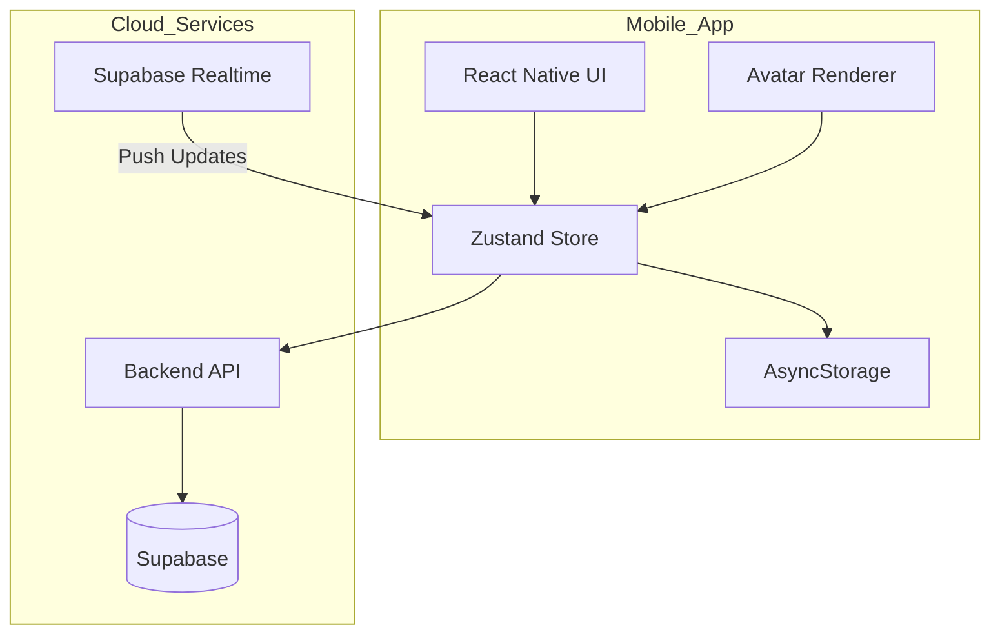
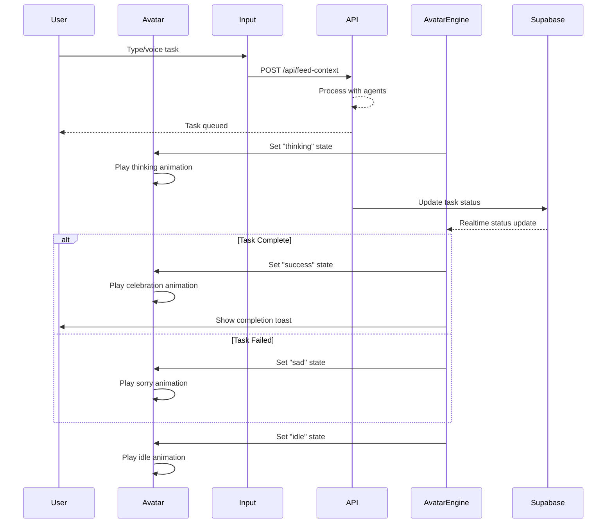
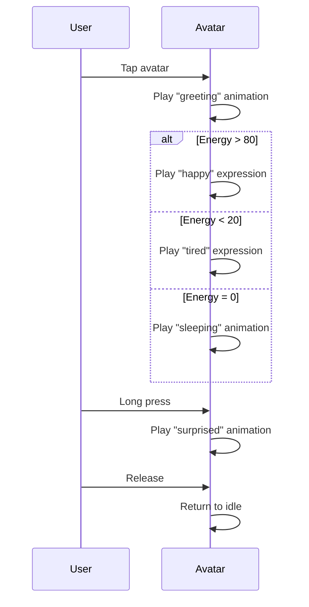
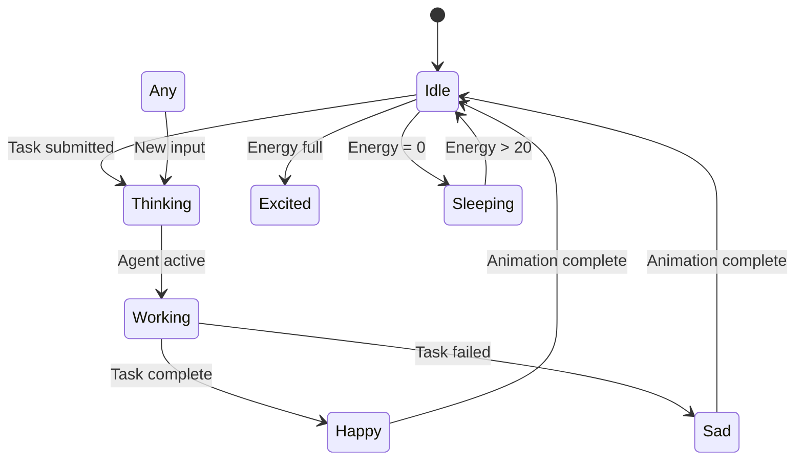
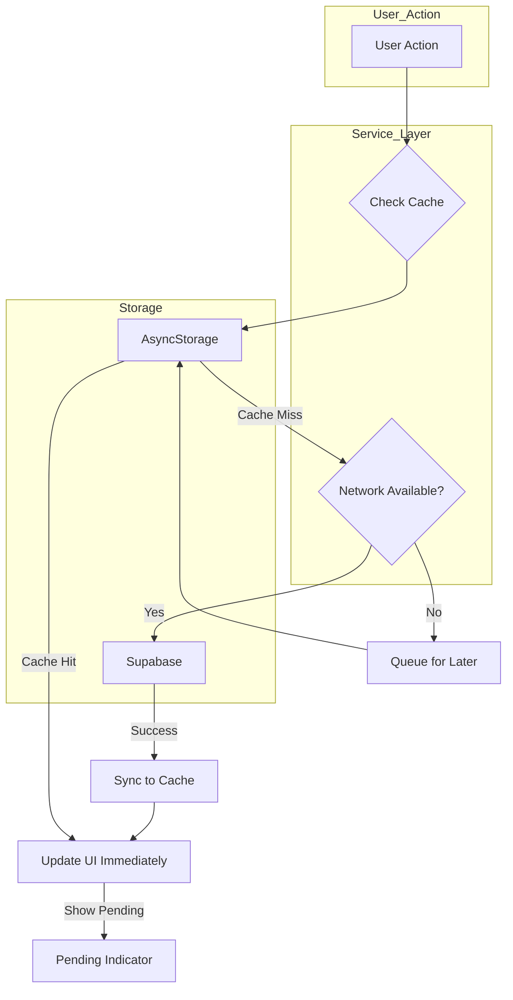
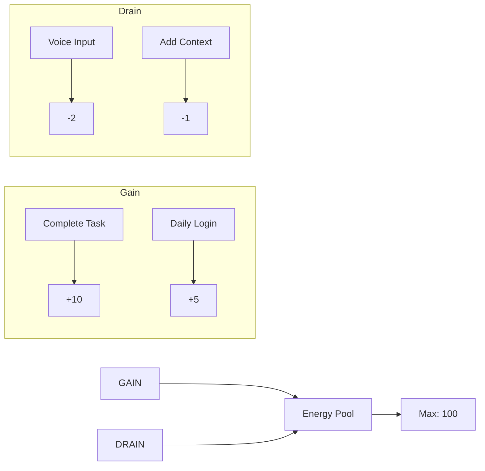

# ProxyOS Gamified AI Workspace App - Architecture

**Version:** 1.0  
**Created:** 2026-02-20  
**Status:** Draft for Review

---

## 1. Executive Summary

This document outlines the architecture for the ProxyOS Gamified AI Workspace mobile/desktop application. The app transforms the existing web-based ProxyOS into an immersive, gamified personal AI assistant experience with an interactive animated avatar, energy systems, achievements, and cross-platform support.

**Key Technical Decisions:**
- **Framework:** React Native with Expo (for faster development and easier builds)
- **Avatar Rendering:** 2D Spritesheets with React Native Animated API
- **State Management:** Zustand (lightweight, persistable, TypeScript-friendly)
- **Real-time:** Supabase Realtime (leveraging existing infrastructure)
- **Offline:** AsyncStorage with background sync when online

---

## 2. Current Architecture Review

### 2.1 Existing Web App Structure

```
apps/web/
├── src/
│   ├── app/
│   │   ├── (dashboard)/page.tsx      # Main dashboard
│   │   └── world-generator/          # World generation feature
│   ├── components/
│   │   ├── game/OfficeCanvas.tsx    # Phaser-based office view
│   │   └── office/
│   │       ├── CommandCenter.tsx    # Task input
│   │       ├── MemoryVault.tsx       # Context storage
│   │       ├── ProxyDashboard.tsx    # Stats display
│   │       └── SwarmDrawer.tsx       # Task management
│   ├── hooks/
│   │   ├── useProxyStats.ts          # Energy & stats
│   │   ├── useSkin.ts                # Avatar skin management
│   │   └── useTasks.ts               # Task list & status
│   └── lib/
│       ├── api.ts                    # Backend API client
│       └── supabase/client.ts        # Database client
```

### 2.2 Existing Backend Integration

The web app communicates with the backend at `apps/backend/server.js`:

- **Endpoint:** `/api/feed-context` - Submit tasks to agents
- **Endpoint:** `/api/swarm-status` - Get task statuses
- **Database:** Supabase with realtime subscriptions
- **Providers:** NVIDIA → Groq → Z.ai → OpenCode → OpenRouter (failover chain)

### 2.3 Existing Data Model

Key tables already in place:
- `proxy_stats` - Energy level, tasks completed, achievements
- `agent_tasks` - Task queue with agent assignments
- `proxy_context` - User context/history
- `agent_memories` - Agent personality data (soul_markdown, memory_markdown)
- `user_preferences` - Active skin, settings

---

## 3. Target Architecture

### 3.1 System Overview



### 3.2 App Architecture Layers

```
┌─────────────────────────────────────────────────────────┐
│                    Presentation Layer                    │
│  ┌─────────────┐ ┌─────────────┐ ┌─────────────────┐  │
│  │   Screens   │ │  Components │ │  Avatar Engine  │  │
│  └─────────────┘ └─────────────┘ └─────────────────┘  │
├─────────────────────────────────────────────────────────┤
│                    State Management                     │
│  ┌─────────────────────────────────────────────────┐   │
│  │              Zustand Global Store                │   │
│  │  - userStore (profile, preferences)              │   │
│  │  - proxyStore (energy, stats, avatar state)      │   │
│  │  - taskStore (tasks, statuses)                   │   │
│  │  - uiStore (navigation, modals)                  │   │
│  └─────────────────────────────────────────────────┘   │
├─────────────────────────────────────────────────────────┤
│                    Service Layer                        │
│  ┌────────────┐ ┌────────────┐ ┌──────────────────┐   │
│  │ API Service│ │ Sync Service│ │ Notification Svc │   │
│  └────────────┘ └────────────┘ └──────────────────┘   │
├─────────────────────────────────────────────────────────┤
│                    Data Layer                           │
│  ┌──────────────────┐       ┌────────────────────┐     │
│  │  AsyncStorage    │       │   Supabase Client  │     │
│  │  (Offline Cache) │◄─────►│   (Cloud DB + RT)  │     │
│  └──────────────────┘       └────────────────────┘     │
└─────────────────────────────────────────────────────────┘
```

---

## 4. App Screens & User Flows

### 4.1 Screen Structure

```
App Navigation (Bottom Tab Navigator)
├── Home Tab
│   ├── Avatar Screen (main interaction)
│   │   ├── Animated Avatar Display
│   │   ├── Energy Ring Widget
│   │   ├── Quick Actions (fab menu)
│   │   └── Status Indicator (thinking/idle/active)
│   └── Command Input Modal
│       ├── Text Input
│       ├── Voice Input Button
│       └── Project Tag Selector
├── Tasks Tab
│   ├── Active Tasks List
│   ├── Task Detail Sheet
│   └── Task History (completed)
├── Progress Tab
│   ├── Level & XP Display
│   ├── Achievements Grid
│   ├── Daily Challenges
│   └── Stats Overview
├── Memory Tab
│   ├── Context Timeline
│   ├── Search & Filter
│   └── Memory Categories
└── Settings Tab
    ├── Avatar Customization
    ├── Skin Selector
    ├── Notifications
    └── Account & Sync
```

### 4.2 User Flows

#### Primary Flow: Submit Task to AI



#### Secondary Flow: Avatar Interaction



---

## 5. Technical Implementation

### 5.1 Technology Stack

| Category | Technology | Rationale |
|----------|------------|-----------|
| **Framework** | React Native + Expo SDK 52 | Native performance, easier builds, good ecosystem |
| **Language** | TypeScript 5.x | Type safety, better IDE support |
| **State** | Zustand + persist | Lightweight, persist middleware for offline |
| **Navigation** | Expo Router | File-based routing, native navigation |
| **Storage** | @react-native-async-storage/async-storage | Offline caching |
| **API Client** | @supabase/supabase-js | Existing infrastructure |
| **Real-time** | Supabase Realtime | Already configured |
| **Animations** | react-native-reanimated + Spritesheets | Smooth 60fps animations |
| **Haptics** | expo-haptics | Tactile feedback |
| **Notifications** | expo-notifications | Push notifications |
| **Icons** | @expo/vector-icons | Consistent icon set |

### 5.2 Avatar Rendering System

#### 5.2.1 Spritesheet Structure

Each skin consists of:
```
skins/{skinId}/
├── manifest.json           # Animation definitions
├── idle/
│   ├── frame_001.png
│   ├── frame_002.png
│   └── ...
├── thinking/
├── happy/
├── sad/
├── excited/
├── sleeping/
└── working/
```

#### 5.2.2 Manifest Schema

```typescript
interface SkinManifest {
  id: string;
  name: string;
  description: string;
  frameSize: { width: number; height: number };
  animations: {
    [key: string]: {
      frames: number[];
      fps: number;
      loop: boolean;
    };
  };
}
```

#### 5.2.3 Avatar Engine Component

```typescript
// components/avatar/AvatarEngine.tsx
interface AvatarState {
  emotion: 'idle' | 'thinking' | 'happy' | 'sad' | 'excited' | 'sleeping' | 'working';
  isSpeaking: boolean;
  energyLevel: number;
}

class AvatarEngine {
  // Load spritesheets for current skin
  loadSkin(skinId: string): Promise<void>;
  
  // Play animation by name
  playAnimation(name: string): void;
  
  // Set avatar state (triggers appropriate animation)
  setState(state: Partial<AvatarState>): void;
  
  // Dispose loaded assets
  cleanup(): void;
}
```

#### 5.2.4 Animation State Machine



### 5.3 State Management

#### 5.3.1 Zustand Store Structure

```typescript
// stores/userStore.ts
interface UserState {
  profile: {
    id: string;
    name: string;
    level: number;
    xp: number;
  };
  preferences: {
    activeSkinId: string;
    notificationsEnabled: boolean;
    hapticFeedback: boolean;
  };
  // Actions
  setProfile: (profile: Partial<UserState['profile']>) => void;
  setPreferences: (prefs: Partial<UserState['preferences']>) => void;
}

// stores/proxyStore.ts
interface ProxyState {
  energy: number;
  maxEnergy: number;
  tasksCompleted: number;
  achievements: string[];
  streak: number;
  lastFedAt: Date | null;
  // Actions
  consumeEnergy: (amount: number) => void;
  replenishEnergy: (amount: number) => void;
  addAchievement: (achievement: string) => void;
}

// stores/taskStore.ts
interface TaskState {
  tasks: AgentTask[];
  activeTaskId: string | null;
  // Actions
  addTask: (task: AgentTask) => void;
  updateTask: (id: string, updates: Partial<AgentTask>) => void;
  setActiveTask: (id: string | null) => void;
}
```

#### 5.3.2 Persistence Strategy

```typescript
import { create } from 'zustand';
import { persist, createJSONStorage } from 'zustand/middleware';
import AsyncStorage from '@react-native-async-storage/async-storage';

const useProxyStore = create<ProxyState>()(
  persist(
    (set) => ({
      energy: 50,
      // ... other state
    }),
    {
      name: 'proxy-storage',
      storage: createJSONStorage(() => AsyncStorage),
      partialize: (state) => ({
        // Only persist these fields
        energy: state.energy,
        tasksCompleted: state.tasksCompleted,
        achievements: state.achievements,
      }),
    }
  )
);
```

### 5.4 Real-time Implementation

#### 5.4.1 Supabase Realtime Subscriptions

```typescript
// services/realtimeService.ts
class RealtimeService {
  private channels: Map<string, RealtimeChannel> = new Map();
  
  subscribeToTasks(callback: (task: AgentTask) => void) {
    const channel = supabase
      .channel('mobile-tasks')
      .on(
        'postgres_changes',
        {
          event: '*',
          schema: 'public',
          table: 'agent_tasks',
        },
        (payload) => callback(payload.new as AgentTask)
      )
      .subscribe();
    
    this.channels.set('tasks', channel);
  }
  
  subscribeToProxyStats(callback: (stats: ProxyStats) => void) {
    const channel = supabase
      .channel('mobile-proxy-stats')
      .on(
        'postgres_changes',
        {
          event: 'UPDATE',
          schema: 'public',
          table: 'proxy_stats',
        },
        (payload) => callback(payload.new as ProxyStats)
      )
      .subscribe();
    
    this.channels.set('proxy-stats', channel);
  }
  
  unsubscribeAll() {
    this.channels.forEach((channel) => supabase.removeChannel(channel));
    this.channels.clear();
  }
}
```

### 5.5 Offline Capabilities

#### 5.5.1 Offline-First Strategy



#### 5.5.2 Offline Queue Implementation

```typescript
// services/syncService.ts
interface QueuedAction {
  id: string;
  type: 'task_create' | 'context_add' | 'preference_update';
  payload: any;
  timestamp: number;
}

class SyncService {
  private queue: QueuedAction[] = [];
  
  async queueAction(action: Omit<QueuedAction, 'id' | 'timestamp'>) {
    const queued: QueuedAction = {
      ...action,
      id: uuid(),
      timestamp: Date.now(),
    };
    
    // Save to AsyncStorage
    const existing = await AsyncStorage.getItem('offline-queue');
    const queue = existing ? JSON.parse(existing) : [];
    queue.push(queued);
    await AsyncStorage.setItem('offline-queue', JSON.stringify(queue));
    
    // Try to process immediately if online
    if (await this.isOnline()) {
      await this.processQueue();
    }
  }
  
  async processQueue() {
    const queue = await AsyncStorage.getItem('offline-queue');
    if (!queue) return;
    
    const actions: QueuedAction[] = JSON.parse(queue);
    const failed: QueuedAction[] = [];
    
    for (const action of actions) {
      try {
        await this.executeAction(action);
      } catch (error) {
        failed.push(action);
      }
    }
    
    // Keep failed actions for retry
    await AsyncStorage.setItem('offline-queue', JSON.stringify(failed));
  }
}
```

---

## 6. Integration with Existing Backend

### 6.1 API Compatibility

The mobile app will use the same backend endpoints as the web app:

| Endpoint | Method | Purpose |
|----------|--------|---------|
| `/api/feed-context` | POST | Submit new task/context |
| `/api/swarm-status` | GET | Get current task statuses |
| `/api/halt-task/:id` | POST | Cancel running task |

### 6.2 Authentication

For MVP: Use anonymous authentication with device ID
- Store `device_id` in AsyncStorage
- Associate with Supabase user record

Future: Add Supabase Auth for multi-device sync

### 6.3 Data Mapping

```typescript
// Map backend response to app state
interface BackendTask {
  id: string;
  agent_role: 'minion' | 'scout' | 'sage';
  task_description: string;
  status: 'pending' | 'working' | 'success' | 'failed' | 'halted';
  created_at: string;
}

interface AppTask {
  id: string;
  agent: 'minion' | 'scout' | 'sage';
  description: string;
  status: TaskStatus;
  createdAt: Date;
  // Enriched fields
  agentAvatar?: string;
  estimatedTime?: number;
}
```

---

## 7. Gamification System

### 7.1 Energy System



### 7.2 Level Progression

| Level | XP Required | Title |
|-------|-------------|-------|
| 1 | 0 | Novice |
| 2 | 100 | Apprentice |
| 3 | 300 | Assistant |
| 4 | 600 | Agent |
| 5 | 1000 | Specialist |
| 6 | 1500 | Expert |
| 7 | 2200 | Master |
| 8 | 3000 | Guru |
| 9 | 4000 | Legend |
| 10 | 5500 | Proxy Master |

### 7.3 Achievement System

| Achievement | Condition | Reward |
|-------------|-----------|--------|
| First Steps | Complete first task | +10 XP |
| On Fire | 5 tasks in a row | +25 XP |
| Workhorse | 50 tasks completed | +100 XP |
| Early Bird | Complete task before 8 AM | +15 XP |
| Night Owl | Complete task after 10 PM | +15 XP |
| Multitasker | 3 agents working simultaneously | +30 XP |
| Explorer | Use all three agents | +20 XP |
| Dedicated | 7-day streak | +50 XP |

### 7.4 Daily Challenges

```typescript
interface DailyChallenge {
  id: string;
  title: string;
  description: string;
  type: 'tasks' | 'energy' | 'agents';
  target: number;
  progress: number;
  reward: {
    xp: number;
    energy?: number;
  };
  expiresAt: Date;
}
```

---

## 8. Database Schema Extensions

### 8.1 New Tables Required

```sql
-- User progress and gamification
CREATE TABLE IF NOT EXISTS public.user_progress (
  id uuid PRIMARY KEY DEFAULT uuid_generate_v4(),
  user_id uuid REFERENCES auth.users(id),
  level INTEGER NOT NULL DEFAULT 1,
  xp INTEGER NOT NULL DEFAULT 0,
  streak_days INTEGER NOT NULL DEFAULT 0,
  last_active_date DATE,
  daily_challenges JSONB NOT NULL DEFAULT '[]'::jsonb,
  created_at TIMESTAMPTZ NOT NULL DEFAULT NOW(),
  updated_at TIMESTAMPTZ NOT NULL DEFAULT NOW()
);

-- Offline sync queue (server-side)
CREATE TABLE IF NOT EXISTS public.sync_queue (
  id uuid PRIMARY KEY DEFAULT uuid_generate_v4(),
  user_id uuid REFERENCES auth.users(id),
  action_type VARCHAR(50) NOT NULL,
  payload JSONB NOT NULL,
  status VARCHAR(20) NOT NULL DEFAULT 'pending',
  processed_at TIMESTAMPTZ,
  created_at TIMESTAMPTZ NOT NULL DEFAULT NOW()
);

-- Daily login tracking
CREATE TABLE IF NOT EXISTS public.daily_logins (
  id uuid PRIMARY KEY DEFAULT uuid_generate_v4(),
  user_id uuid REFERENCES auth.users(id),
  login_date DATE NOT NULL UNIQUE,
  energy_rewarded BOOLEAN NOT NULL DEFAULT FALSE,
  created_at TIMESTAMPTZ NOT NULL DEFAULT NOW()
);
```

### 8.2 Schema Updates

```sql
-- Add new fields to existing proxy_stats
ALTER TABLE public.proxy_stats 
ADD COLUMN IF NOT EXISTS streak_days INTEGER DEFAULT 0,
ADD COLUMN IF NOT EXISTS last_fed_date DATE;

-- Enable realtime for new tables
ALTER PUBLICATION supabase_realtime ADD TABLE
  public.user_progress,
  public.sync_queue;
```

---

## 9. MVP Feature Scope

### 9.1 Must Have (MVP)

- [ ] Avatar display with basic animations (idle, thinking, happy, sad)
- [ ] Energy system UI with visual ring
- [ ] Command input (text + voice)
- [ ] Task list with status indicators
- [ ] Basic skin selector (default, portalSciFi)
- [ ] Settings screen
- [ ] Offline task queue
- [ ] Supabase realtime sync

### 9.2 Should Have (Post-MVP)

- [ ] Level progression system
- [ ] Achievement notifications
- [ ] Daily challenges
- [ ] Memory vault timeline
- [ ] Project tagging
- [ ] Push notifications
- [ ] Haptic feedback

### 9.3 Nice to Have (Future)

- [ ] Custom sprite creation tool
- [ ] Community achievements
- [ ] Avatar reactions to system state
- [ ] Widget support (iOS/Android)
- [ ] Watch app companion

---

## 10. File Structure

### 10.1 Proposed Expo App Structure

```
apps/mobile/  (NEW)
├── app/                    # Expo Router screens
│   ├── (tabs)/
│   │   ├── _layout.tsx
│   │   ├── index.tsx       # Home/Avatar screen
│   │   ├── tasks.tsx       # Tasks list
│   │   ├── progress.tsx     # Level & achievements
│   │   ├── memory.tsx      # Memory vault
│   │   └── settings.tsx    # Settings
│   ├── _layout.tsx
│   ├── modal/
│   │   └── command.tsx     # Command input modal
│   └── +html.tsx          # Deep link handler
├── src/
│   ├── components/
│   │   ├── avatar/
│   │   │   ├── AvatarEngine.tsx
│   │   │   ├── SpriteSheet.tsx
│   │   │   ├── animations.ts
│   │   │   └── skins/
│   │   │       ├── default/
│   │   │       └── portalSciFi/
│   │   ├── ui/
│   │   │   ├── EnergyRing.tsx
│   │   │   ├── TaskCard.tsx
│   │   │   └── AchievementBadge.tsx
│   │   └── layout/
│   │       ├── TabNavigator.tsx
│   │       └── Header.tsx
│   ├── stores/
│   │   ├── userStore.ts
│   │   ├── proxyStore.ts
│   │   ├── taskStore.ts
│   │   └── uiStore.ts
│   ├── services/
│   │   ├── api.ts
│   │   ├── realtime.ts
│   │   ├── sync.ts
│   │   └── notifications.ts
│   ├── hooks/
│   │   ├── useProxy.ts
│   │   ├── useTasks.ts
│   │   └── useRealtime.ts
│   ├── utils/
│   │   ├── constants.ts
│   │   └── helpers.ts
│   └── types/
│       └── index.ts
├── assets/
│   ├── skins/
│   └── fonts/
├── package.json
└── app.json
```

---

## 11. Implementation Roadmap

### Phase 1: Foundation (Week 1-2)

1. Initialize Expo project with TypeScript
2. Set up navigation (bottom tabs)
3. Configure Zustand stores with persistence
4. Implement Supabase client and realtime
5. Create base UI components

### Phase 2: Core Features (Week 3-4)

1. Build Avatar Engine with spritesheet support
2. Implement Command Input screen
3. Create Task List screen
4. Add Energy system with visual ring
5. Connect to backend API

### Phase 3: Gamification (Week 5-6)

1. Add level and XP tracking
2. Implement achievements system
3. Create daily challenges
4. Add streak tracking
5. Build Progress screen

### Phase 4: Polish (Week 7-8)

1. Add offline queue and sync
2. Implement push notifications
3. Add haptic feedback
4. Polish animations
5. Performance optimization

---

## 12. Testing Strategy

### 12.1 Unit Tests

- Zustand store actions
- Utility functions
- API response mapping

### 12.2 Integration Tests

- Supabase realtime connection
- Offline queue processing
- Backend API communication

### 12.3 E2E Tests (Detox)

- Complete task flow
- Avatar interaction
- Settings changes

---

## 13. Performance Considerations

### 13.1 Mobile Optimization

- **Image Assets:** Use appropriate resolutions for each device density (@2x, @3x)
- **Animations:** Target 60fps, use native driver where possible
- **Memory:** Unload spritesheets when not visible
- **Battery:** Reduce animation fps when app is backgrounded

### 13.2 Bundle Size

- Lazy load skins not in use
- Use Expo's metro bundler for tree shaking
- Optimize assets before bundling

---

## 14. Security Considerations

- Store sensitive data in SecureStore (for auth tokens)
- Validate all API responses
- Sanitize user inputs
- Implement rate limiting client-side

---

## 15. Appendix

### A. Related Documentation

- [Backend Architecture](../apps/backend/server.js)
- [Supabase Schema](../infra/supabase-schema.sql)
- [Existing Web Components](../apps/web/src/components/)
- [Agent System](../agents/)

### B. Dependencies

```json
{
  "dependencies": {
    "expo": "~52.0.0",
    "expo-router": "~4.0.0",
    "react-native": "0.76.5",
    "@supabase/supabase-js": "^2.39.0",
    "zustand": "^4.5.0",
    "react-native-reanimated": "~3.16.0",
    "@react-native-async-storage/async-storage": "1.23.1",
    "expo-haptics": "~14.0.0",
    "expo-notifications": "~0.29.0",
    "expo-speech": "~13.0.0",
    "@expo/vector-icons": "^14.0.0",
    "date-fns": "^3.0.0"
  }
}
```

---

**Document Status:** Draft for Review  
**Next Steps:** Review with team, finalize MVP scope, begin implementation

