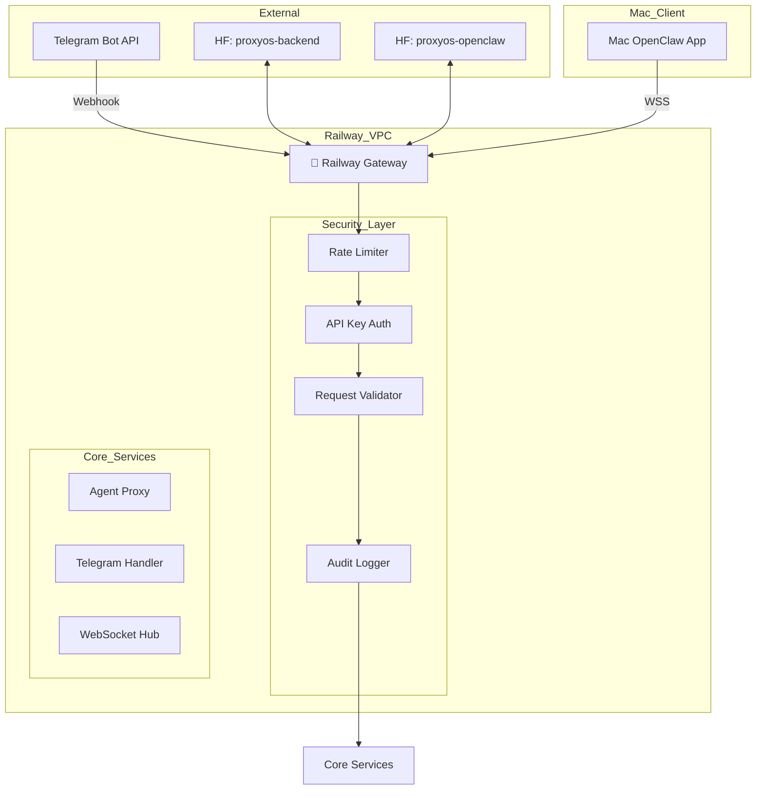

# Railway Gateway Security Architecture

**Purpose:** Securely connect Mac OpenClaw app to HuggingFace Spaces with Telegram channel support  
**Status:** Architecture Design  
**Last Updated:** 2026-02-20

---

## 1. Current Architecture Analysis

### 1.1 Existing Components

```
┌─────────────────────────────────────────────────────────────────────────────┐
│                         CURRENT SETUP                                       │
└─────────────────────────────────────────────────────────────────────────────┘

┌─────────────┐     ┌──────────────────┐     ┌───────────────────────────┐
│  Mac App    │────►│  Railway Gateway │────►│  HuggingFace Spaces       │
│  (OpenClaw) │     │  (proxyos-open)  │     │  • proxyos-backend       │
│             │     │                  │     │  • proxyos-openclaw      │
└─────────────┘     └──────────────────┘     └───────────────────────────┘
                              │
                              │ Telegram Webhook
                              ▼
                        ┌─────────────┐
                        │  Telegram   │
                        │  Bot API    │
                        └─────────────┘
```

### 1.2 Current Gateway (`proxyos-openclaw/gateway-server.js`)

**Existing Features:**
- Express server on port 3000
- WebSocket server at `/ws`
- Proxies to HF OpenCloud at `/api/agent`
- Health endpoint at `/health`

**Security Issues Identified:**
1. ❌ No API key authentication on endpoints
2. ❌ No Telegram webhook verification
3. ❌ WebSocket connections unauthenticated
4. ❌ No rate limiting
5. ❌ No request validation
6. ❌ Environment variables may be exposed

---

## 2. Secure Architecture Design

### 2.1 Target Architecture



### 2.2 Security Layers

| Layer | Component | Purpose |
|-------|-----------|---------|
| 1 | **Rate Limiting** | Prevent DDoS/abuse |
| 2 | **API Key Auth** | Verify client identity |
| 3 | **Request Validation** | Sanitize inputs |
| 4 | **Audit Logging** | Track all requests |
| 5 | **Secrets Management** | Secure env vars |

---

## 3. Implementation Plan

### 3.1 Step 1: Secure Environment Configuration

Create a `.env` file with secure defaults:

```bash
# Railway Gateway Environment Variables

# Server Configuration
PORT=3000
NODE_ENV=production

# Security Keys (generate with: openssl rand -base64 32)
API_AUTH_TOKEN=your-secure-random-string-here
TELEGRAM_WEBHOOK_SECRET=your-telegram-secret-here

# HuggingFace Space URLs
HF_BACKEND_URL=https://taz7770-proxyos-backend.hf.space
HF_OPENCLOUD_URL=https://taz7770-proxyos-openclaw.hf.space

# Rate Limiting
RATE_LIMIT_WINDOW=60000      # 1 minute
RATE_LIMIT_MAX_REQUESTS=100  # requests per window
```

### 3.2 Step 2: Enhanced Gateway Server

Create `proxyos-openclaw/secure-gateway.js`:

```javascript
import express from 'express';
import { createServer } from 'http';
import { WebSocketServer } from 'ws';
import fetch from 'node-fetch';
import crypto from 'crypto';

const app = express();
app.use(express.json());

// ============================================
// SECURITY CONFIGURATION
// ============================================

const CONFIG = {
  apiAuthToken: process.env.API_AUTH_TOKEN,
  telegramSecret: process.env.TELEGRAM_WEBHOOK_SECRET,
  hfBackendUrl: process.env.HF_BACKEND_URL || 'https://taz7770-proxyos-backend.hf.space',
  hfOpenCloudUrl: process.env.HF_OPENCLOUD_URL || 'https://taz7770-proxyos-openclaw.hf.space',
  rateLimit: {
    windowMs: parseInt(process.env.RATE_LIMIT_WINDOW || '60000'),
    maxRequests: parseInt(process.env.RATE_LIMIT_MAX_REQUESTS || '100')
  }
};

// ============================================
// SECURITY MIDDLEWARE
// ============================================

// Rate Limiter
const rateLimitMap = new Map();

function rateLimiter(req, res, next) {
  const ip = req.ip || req.connection.remoteAddress;
  const now = Date.now();
  const key = `${ip}:${req.path}`;
  
  const record = rateLimitMap.get(key) || { count: 0, resetAt: now + CONFIG.rateLimit.windowMs };
  
  if (now > record.resetAt) {
    record.count = 0;
    record.resetAt = now + CONFIG.rateLimit.windowMs;
  }
  
  record.count++;
  rateLimitMap.set(key, record);
  
  if (record.count > CONFIG.rateLimit.maxRequests) {
    return res.status(429).json({ error: 'Rate limit exceeded' });
  }
  
  next();
}

// API Key Authentication
function authenticate(req, res, next) {
  const authHeader = req.headers.authorization;
  
  if (!authHeader || !authHeader.startsWith('Bearer ')) {
    return res.status(401).json({ error: 'Missing or invalid authorization header' });
  }
  
  const token = authHeader.substring(7);
  
  if (token !== CONFIG.apiAuthToken) {
    console.warn(`[SECURITY] Invalid API token attempt from ${req.ip}`);
    return res.status(403).json({ error: 'Invalid API token' });
  }
  
  next();
}

// Request Validation
function validateRequest(req, res, next) {
  const allowedPaths = [
    '/health',
    '/api/status',
    '/api/agent',
    '/api/telegram/webhook',
    '/ws'
  ];
  
  // Health and status are public
  if (req.path === '/health' || req.path === '/api/status') {
    return next();
  }
  
  // WebSocket path is handled separately
  if (req.path.startsWith('/ws')) {
    return next();
  }
  
  // Telegram webhook - verify secret
  if (req.path === '/api/telegram/webhook') {
    const secret = req.query.secret;
    if (secret !== CONFIG.telegramSecret) {
      return res.status(403).json({ error: 'Invalid webhook secret' });
    }
    return next();
  }
  
  // All other API endpoints require auth
  return authenticate(req, res, next);
}

// Audit Logger
function auditLog(req, action, details = {}) {
  const logEntry = {
    timestamp: new Date().toISOString(),
    ip: req.ip,
    method: req.method,
    path: req.path,
    action,
    ...details
  };
  console.log(`[AUDIT] ${JSON.stringify(logEntry)}`);
}

// ============================================
// EXPRESS MIDDLEWARE STACK
// ============================================

app.use(rateLimiter);
app.use(validateRequest);

// ============================================
// HEALTH ENDPOINTS (Public)
// ============================================

app.get('/health', (req, res) => {
  res.json({ 
    status: 'healthy', 
    timestamp: new Date().toISOString(),
    security: 'enabled'
  });
});

app.get('/api/status', (req, res) => {
  res.json({ 
    status: 'online', 
    service: 'proxyos-secure-gateway',
    version: '1.0.0'
  });
});

// ============================================
// AGENT API PROXY (Protected)
// ============================================

app.post('/api/agent', async (req, res) => {
  try {
    auditLog(req, 'agent_request', { body: req.body });
    
    const response = await fetch(`${CONFIG.hfOpenCloudUrl}/api/agent`, {
      method: 'POST',
      headers: { 
        'Content-Type': 'application/json',
        'Authorization': `Bearer ${CONFIG.apiAuthToken}`
      },
      body: JSON.stringify(req.body)
    });
    
    const data = await response.json();
    res.json(data);
  } catch (error) {
    console.error('[ERROR] Agent proxy:', error);
    res.status(500).json({ error: error.message });
  }
});

// ============================================
// TELEGRAM WEBHOOK (Protected)
// ============================================

app.post('/api/telegram/webhook', async (req, res) => {
  try {
    const { message, callback_query } = req.body;
    const chatId = message?.chat?.id || callback_query?.message?.chat?.id;
    
    auditLog(req, 'telegram_webhook', { chatId });
    
    // Process message through OpenClaw
    const userMessage = message?.text || callback_query?.data;
    
    if (userMessage) {
      const response = await fetch(`${CONFIG.hfOpenCloudUrl}/api/agent`, {
        method: 'POST',
        headers: { 'Content-Type': 'application/json' },
        body: JSON.stringify({
          message: userMessage,
          channel: 'telegram',
          chatId: chatId
        })
      });
      
      const result = await response.json();
      
      // Send response back to Telegram
      await fetch(`https://api.telegram.org/bot${process.env.TELEGRAM_BOT_TOKEN}/sendMessage`, {
        method: 'POST',
        headers: { 'Content-Type': 'application/json' },
        body: JSON.stringify({
          chat_id: chatId,
          text: result.aggregated_text || result.response || 'Processing...'
        })
      });
    }
    
    res.json({ ok: true });
  } catch (error) {
    console.error('[ERROR] Telegram webhook:', error);
    res.json({ ok: false, error: error.message });
  }
});

// ============================================
// WEBSOCKET SERVER (Mac App Connection)
// ============================================

const server = createServer(app);
const wss = new WebSocketServer({ server, path: '/ws' });

const authenticatedClients = new Map();

wss.on('connection', (ws, req) => {
  // Extract token from query string
  const url = new URL(req.url, 'http://localhost');
  const token = url.searchParams.get('token');
  
  // Validate token
  if (token !== CONFIG.apiAuthToken) {
    ws.close(4001, 'Invalid authentication');
    console.warn(`[SECURITY] Unauthorized WebSocket attempt from ${req.ip}`);
    return;
  }
  
  const clientId = crypto.randomUUID();
  console.log(`[WS] Client connected: ${clientId}`);
  
  authenticatedClients.set(clientId, { 
    ws, 
    connectedAt: new Date().toISOString(),
    ip: req.ip
  });
  
  ws.on('message', async (message) => {
    try {
      const data = JSON.parse(message);
      auditLog(req, 'ws_message', { clientId, type: data.type });
      
      if (data.type === 'prompt') {
        const response = await fetch(`${CONFIG.hfOpenCloudUrl}/api/agent`, {
          method: 'POST',
          headers: { 'Content-Type': 'application/json' },
          body: JSON.stringify({
            message: data.content,
            model: data.model || 'default'
          })
        });
        
        const result = await response.json();
        
        ws.send(JSON.stringify({
          type: 'response',
          content: result.aggregated_text || JSON.stringify(result)
        }));
      } else if (data.type === 'ping') {
        ws.send(JSON.stringify({ type: 'pong' }));
      }
    } catch (error) {
      console.error('[WS ERROR]', error);
      ws.send(JSON.stringify({ type: 'error', message: error.message }));
    }
  });
  
  ws.on('close', () => {
    console.log(`[WS] Client disconnected: ${clientId}`);
    authenticatedClients.delete(clientId);
  });
  
  // Send welcome message
  ws.send(JSON.stringify({ 
    type: 'connected', 
    clientId,
    message: 'Connected to ProxyOS Secure Gateway' 
  }));
});

// ============================================
// SERVER STARTUP
// ============================================

const PORT = process.env.PORT || 3000;

server.listen(PORT, '0.0.0.0', () => {
  console.log(`
╔═══════════════════════════════════════════════════════════╗
║     🚂 ProxyOS Secure Gateway v1.0.0                     ║
╠═══════════════════════════════════════════════════════════╣
║  HTTP:      http://localhost:${PORT}                        ║
║  WebSocket: ws://localhost:${PORT}/ws                       ║
║  Health:    http://localhost:${PORT}/health                 ║
╠═══════════════════════════════════════════════════════════╣
║  Security:  ✓ Rate Limiting                               ║
║             ✓ API Key Authentication                       ║
║             ✓ Request Validation                           ║
║             ✓ Audit Logging                                ║
╚═══════════════════════════════════════════════════════════╝
  `);
});

export { app, wss, CONFIG };
```

### 3.3 Step 3: Update Railway Configuration

Update `proxyos-openclaw/railway.json`:

```json
{
  "$schema": "https://railway.app/railway.schema.json",
  "build": {
    "builder": "NIXPACKS",
    "buildCommand": "npm install",
    "start": "node secure-gateway.js"
  },
  "deploy": {
    "numReplicas": 1,
    "restartPolicyType": "ON_FAILURE",
    "restartPolicyMaxRetries": 10
  },
  "env": {
    "GROUP": "main",
    "variables": [
      {
        "key": "API_AUTH_TOKEN",
        "generateValue": true
      },
      {
        "key": "TELEGRAM_WEBHOOK_SECRET",
        "generateValue": true
      }
    ]
  }
}
```

---

## 4. Mac App Connection

### 4.1 Connecting Mac App to Railway Gateway

Update the Mac app to use WebSocket with authentication:

```javascript
// Mac OpenClaw - Secure Connection
const GATEWAY_URL = process.env.GATEWAY_URL || 'wss://your-railway-app.up.railway.app';
const API_TOKEN = process.env.API_TOKEN;  // From Railway secrets

// Connect with authentication
const ws = new WebSocket(`${GATEWAY_URL}/ws?token=${API_TOKEN}`);

ws.on('open', () => {
  console.log('🔐 Connected to secure gateway');
});

ws.on('message', (data) => {
  const message = JSON.parse(data);
  // Handle messages
});
```

### 4.2 Mac App Environment Setup

```bash
# Mac App - .env file
GATEWAY_URL=wss://your-railway-domain.up.railway.app
API_TOKEN=your-railway-api-token
```

---

## 5. Telegram Configuration

### 5.1 Setting Up Telegram Bot

1. **Create Bot via @BotFather** (if not already done)
   - Get bot token

2. **Set Webhook with Secret**
   ```bash
   curl -X POST "https://api.telegram.org/bot<BOT_TOKEN>/setWebhook" \
     -d "url=https://your-railway-app.up.railway.app/api/telegram/webhook?secret=YOUR_TELEGRAM_SECRET"
   ```

3. **Add to Railway Environment**
   ```
   TELEGRAM_BOT_TOKEN=your-bot-token
   TELEGRAM_WEBHOOK_SECRET=your-secret (matches above)
   ```

### 5.2 Telegram Security Checklist

- [ ] Use webhook URL with secret parameter
- [ ] Verify bot token in requests (optional additional check)
- [ ] Set allowed users list
- [ ] Enable rate limiting per user

---

## 6. Testing & Validation

### 6.1 Security Tests

```bash
# 1. Test health endpoint (public)
curl https://your-railway-app.up.railway.app/health
# Expected: {"status":"healthy",...}

# 2. Test unauthenticated access (should fail)
curl -X POST https://your-railway-app.up.railway.app/api/agent \
  -H "Content-Type: application/json" \
  -d '{"message": "test"}'
# Expected: 401 Unauthorized

# 3. Test with valid token (should work)
curl -X POST https://your-railway-app.up.railway.app/api/agent \
  -H "Content-Type: application/json" \
  -H "Authorization: Bearer YOUR_API_TOKEN" \
  -d '{"message": "hello"}'
# Expected: AI response

# 4. Test WebSocket connection
wscat -c "wss://your-railway-app.up.railway.app/ws?token=YOUR_API_TOKEN"
# Expected: {"type":"connected",...}

# 5. Test rate limiting (should fail after limit)
for i in {1..101}; do 
  curl -s -o /dev/null -w "%{http_code}\n" \
    https://your-railway-app.up.railway.app/health
done
# Expected: Most return 200, last few return 429
```

### 6.2 Telegram Tests

```bash
# Send message to bot
# Should receive response through webhook
```

---

## 7. Deployment Checklist

### 7.1 Pre-Deployment

- [ ] Generate secure API token (`openssl rand -base64 32`)
- [ ] Generate Telegram webhook secret
- [ ] Update Railway configuration with secrets
- [ ] Test locally with `node secure-gateway.js`

### 7.2 Railway Deployment

```bash
# Install Railway CLI
npm install -g @railway/cli

# Login
railway login

# Initialize project
cd proxyos-openclaw
railway init

# Add variables
railway variables set API_AUTH_TOKEN=your-token
railway variables set TELEGRAM_BOT_TOKEN=your-bot-token
railway variables set TELEGRAM_WEBHOOK_SECRET=your-secret
railway variables set HF_BACKEND_URL=https://taz7770-proxyos-backend.hf.space
railway variables set HF_OPENCLOUD_URL=https://taz7770-proxyos-openclaw.hf.space

# Deploy
railway up
```

### 7.3 Post-Deployment

- [ ] Verify health endpoint
- [ ] Test API with authentication
- [ ] Test WebSocket connection
- [ ] Set Telegram webhook
- [ ] Test Telegram bot end-to-end

---

## 8. Security Hardening Recommendations

### 8.1 Additional Improvements (Future)

| Enhancement | Description |
|-------------|-------------|
| **mTLS** | Mutual TLS for service-to-service |
| **JWT Auth** | Replace static tokens with JWT |
| **IP Whitelist** | Restrict by IP for extra security |
| **Encryption at Rest** | Encrypt sensitive logs |
| **Monitoring** | Add intrusion detection |

### 8.2 Environment-Specific Settings

**Production:**
```bash
NODE_ENV=production
RATE_LIMIT_WINDOW=60000
RATE_LIMIT_MAX_REQUESTS=50
```

**Development:**
```bash
NODE_ENV=development
RATE_LIMIT_WINDOW=60000
RATE_LIMIT_MAX_REQUESTS=200
```

---

## 9. Troubleshooting

### Common Issues

| Issue | Solution |
|-------|----------|
| WebSocket connection fails | Verify token in query string |
| 401 on API calls | Check Authorization header format |
| Telegram not responding | Verify webhook URL with secret |
| Rate limited | Wait and retry, or increase limit |
| HF Space unreachable | Check HF_BACKEND_URL and network |

---

## 10. Summary

This architecture provides:

1. ✅ **API Key Authentication** - All endpoints protected except health/status
2. ✅ **Rate Limiting** - Prevents abuse
3. ✅ **Telegram Webhook Security** - Secret-based verification
4. ✅ **WebSocket Authentication** - Token validation on connect
5. ✅ **Audit Logging** - Track all requests for security monitoring
6. ✅ **Railway Ready** - Configuration ready for deployment

---

**Next Steps:**
1. Deploy secure gateway to Railway
2. Update Mac app with new WebSocket URL and token
3. Configure Telegram webhook
4. Test end-to-end flow

